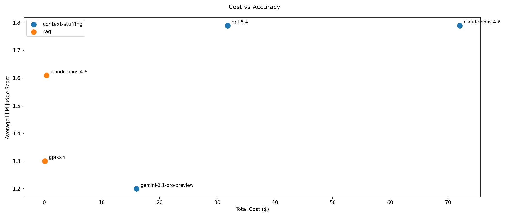
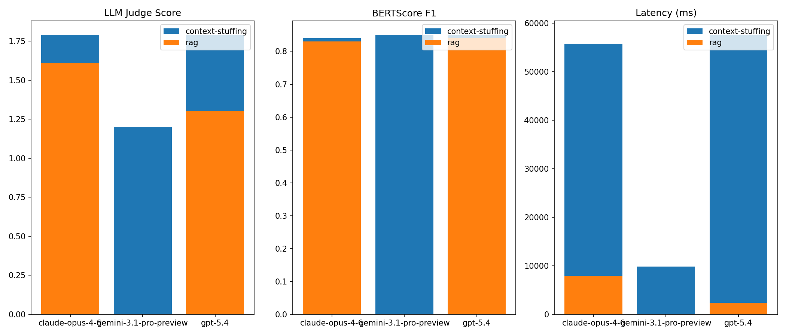

# Eval Questions 1 - Results

Evaluation was run on 33 questions from [eval questions 1](eval-questions/eval_questions_1.jsonl). Here is a table of the recorded results:

| Model | Test | Avg Latency (ms) | Avg BERTScore | Avg Judge Score | Total Cost | Count |
| --- | --- | --- | --- | --- | --- | --- |
| Claude Opus 4.6 | Context Stuffing | 55730.38 | 0.84 | 1.79 | 72.06 | 33 |
| Claude Opus 4.6 | RAG | 7908.68 | 0.83 | 1.61 | 00.40 | 33 |
| Gemini 3.1 Pro Preview | Context Stuffing | 9870.53 | 0.85 | 1.2 | 15.99 | 33 |
| GPT-5.4 | Context Stuffing | 57573.79 | 0.85 | 1.79 | 31.81 | 33 |
| GPT-5.4 | RAG | 2371.18 | 0.84 | 1.3 | 0.12 | 33 |

_Based on data from [summary table](eval-results/summary_table.csv)_
**NOTE: Gemini may not be entirely accurate as it did not complete all lines, most are errors**

## Cost vs Accuracy Scatter Graph

## Overall Comparison Chart

## Key Findings

1. Rag is faster and cheaper - looking at Claude and GPT, the RAG implementation is significantly faster for both. Claude drops from 55730.38 ms (approx. 55 seconds) with context-stuffing to 7908.68 ms (approx. 7 seconds) with RAG. With regards to cost, RAG is also much cheaper that context-stuffing. For example, GPT costs appoximately 260 times more to run with context-stuffing than with RAG implenetation (RAG: 0.12 vs CS: 31.81).
2. Context Stuffing scores higher on accuracy - For both model, the accuracy scores are better with context-stuffing. For the BERTScore, it is pretty minimal with only 0.01 in the difference for the most part. But the judge score has a pretty big jump for GPT with RAG only being 1.3 (65% accuracy), and context-stuffing being 1.79 (89.5% accuracy).